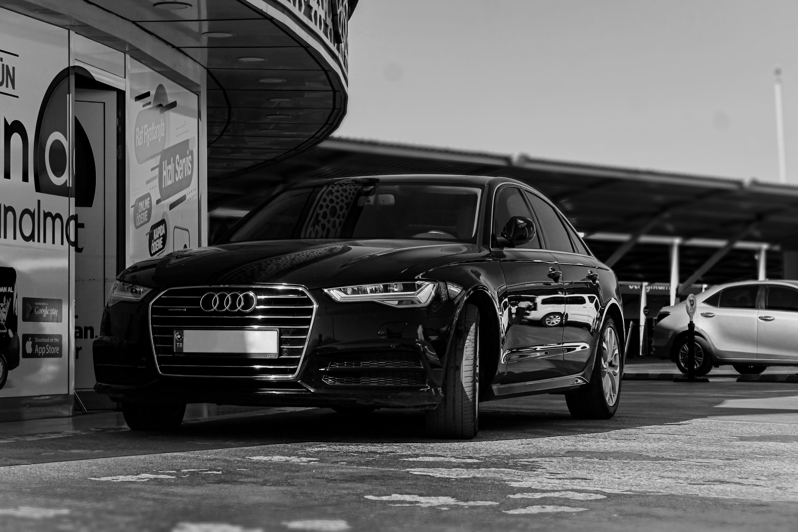
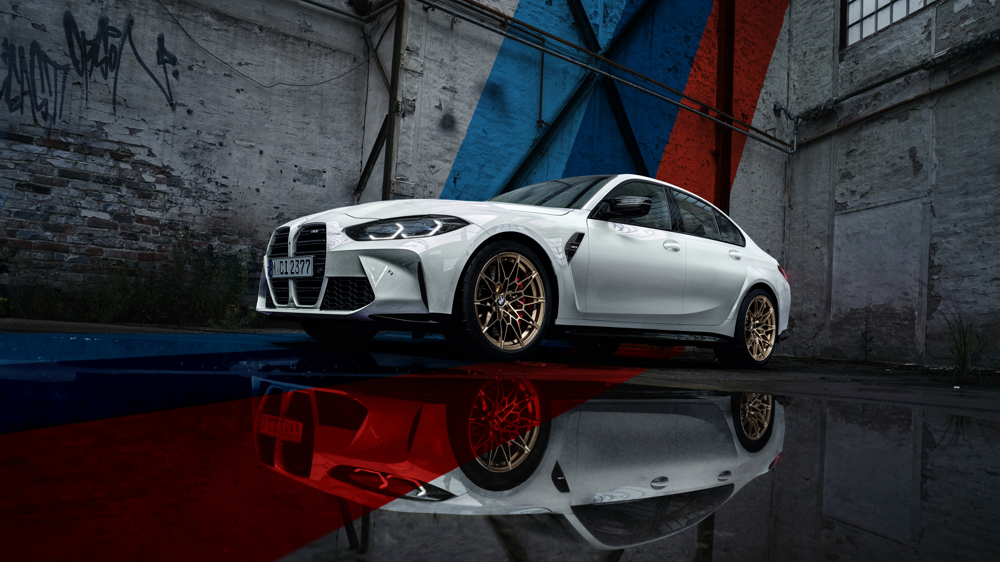
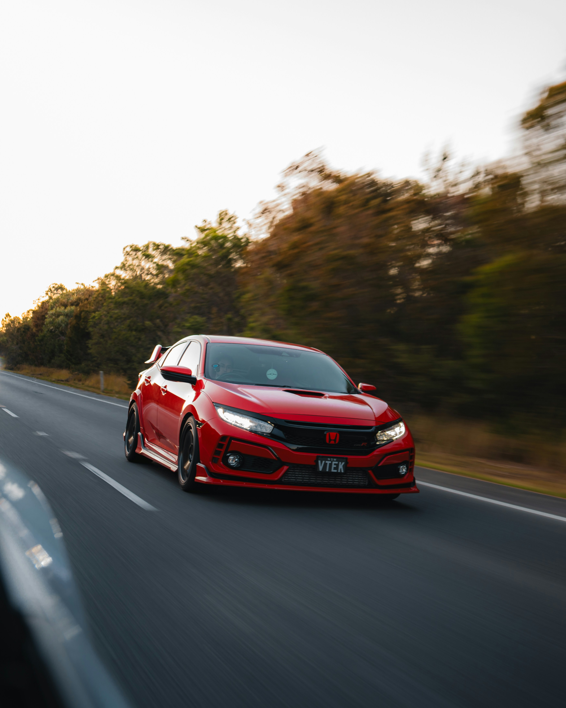
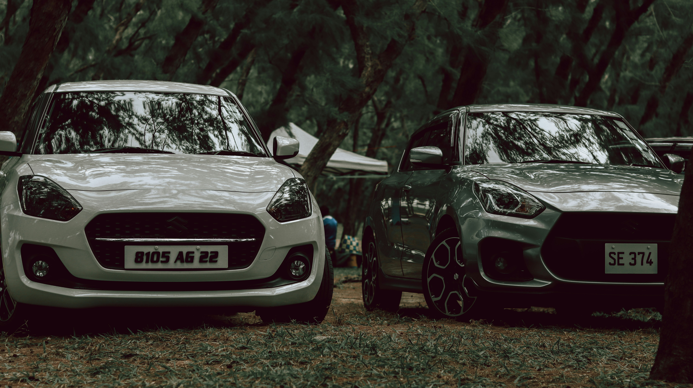

# Car Images

Place your car images in this folder with the following names:

## Required Images:
1. `bmw_3series.jpg` - BMW 3 Series
2. `mercedes_cclass.jpg` - Mercedes C-Class
3. `audi_a4.jpg` - Audi A4
4. `tesla_model3.jpg` - Tesla Model 3
5. `toyota_corolla.jpg` - Toyota Corolla
6. `honda_civic.jpg` - Honda Civic
7. `suzuki_swift.jpg` - Suzuki Swift
8. `bmw_5series.jpg` - BMW 5 Series
9. `audi_a6.jpg` - Audi A6

## Image Requirements:
- Format: JPG or PNG
- Recommended size: 800x400 pixels (16:9 ratio)
- File size: Keep under 500KB for optimal performance

## How to Get Free Car Images:
1. **Unsplash** (https://unsplash.com) - Free high-quality images
2. **Pexels** (https://pexels.com) - Free stock photos
3. **Pixabay** (https://pixabay.com) - Free images and videos

## Quick Download Commands:
You can download sample images using these search terms on the sites above:
- "BMW 3 series"
- "Mercedes C class"
- "Audi A4"
- "Tesla Model 3"
- "Toyota Corolla"
- "Honda Civic"
- "Suzuki Swift"
- "BMW 5 series"
- "Audi A6"

## Note:
Until you add real images, the app will show a placeholder car icon when images are missing.
        